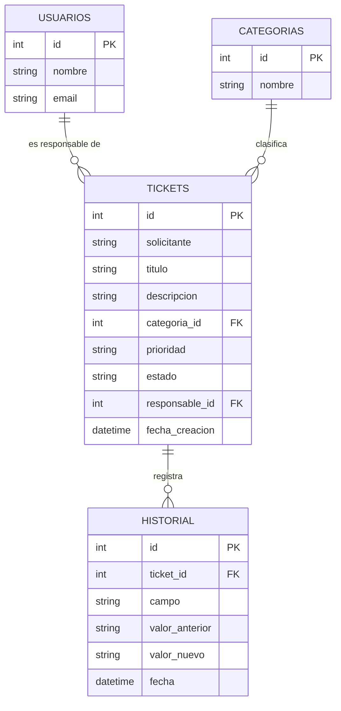

# Modelo ER (pegar en https://mermaid.live y exportar PNG)

```mermaid
erDiagram
    USUARIOS ||--o{ TICKETS : "es responsable de"
    CATEGORIAS ||--o{ TICKETS : clasifica
    TICKETS ||--o{ HISTORIAL : registra
    USUARIOS { int id PK
      string nombre
      string email }
    CATEGORIAS { int id PK
      string nombre }
    TICKETS { int id PK
      string solicitante
      string titulo
      string descripcion
      int categoria_id FK
      string prioridad
      string estado
      int responsable_id FK
      datetime fecha_creacion }
    HISTORIAL { int id PK
      int ticket_id FK
      string campo
      string valor_anterior
      string valor_nuevo
      datetime fecha }
```
Script: `schema.sql` (CHECK en prioridad y estado, claves foráneas activas).
